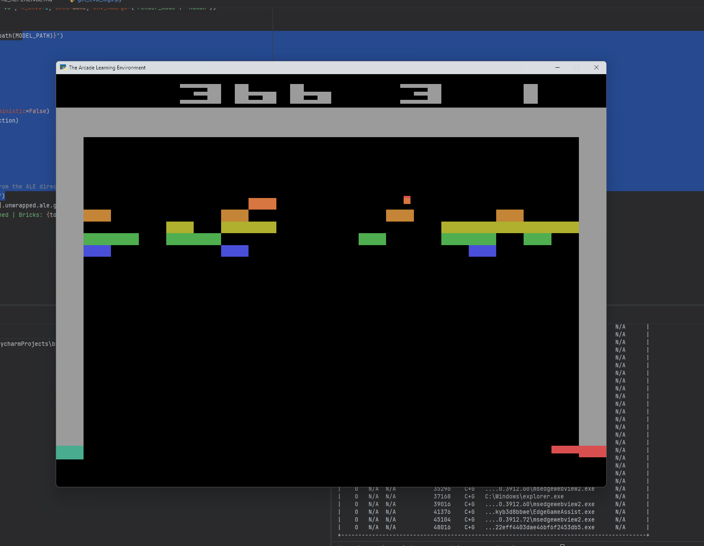

# BreakoutBot 🎮

A reinforcement learning agent trained to play Atari Breakout using PPO (Proximal Policy Optimization) via Stable-Baselines3. Built as a first foray into RL — no pretrained models or copied hyperparameters, everything discovered through systematic experimentation.

## Current Best Performance



- **Peak Eval Score:** 147.02 (pixel-based, sticky actions, PPO_27 at 867M timesteps)
- **Best Real Game Score:** 600+ (confirmed tunnel exploit — ball trapped behind brick wall)
- **Total Steps Trained:** 2.9B+ combined across PPO_25/26/27
- **Single-Env Leader (10k games):** PPO_26 — avg 54.3, median 46.0, **0% zero-score games**, funnel rate 0.07%
- **Key Finding:** Sticky actions alone don't fix the zero-score failure mode — PPO_27 (fresh + sticky) hit 21.3% zero-score, *worse* than PPO_25's 20.0%. PPO_26's elimination of zero-score games came from combining a deep non-sticky foundation (838M steps) with sticky-action refinement (~1B steps).
---

## Approach

This project went through three distinct phases:

### Phase 1: Pixel-Based Training (PPO_5 through PPO_14)
The agent learned directly from stacked game frames using a CNN policy. After 9 runs and 35M+ steps, a peak eval score of 85.4 was achieved with the following configuration:

```
n_envs=32, batch_size=1024, lr=2.5e-4, ent_coef=0.006, net_arch=[64,64]
```

### Phase 2: RAM-Based Training with Reward Shaping (PPO_15–PPO_19)
Switched to reading the Atari RAM directly, which gives access to exact game state values. This enabled faster training (1400+ fps) and precise reward shaping, but the approach was ultimately abandoned after underperforming pixel runs. Reward shaping backfired — the agent learned to mirror the ball without actually scoring points.

### Phase 3: Back to Pixels with Linear Decay (PPO_20+)
Returned to pixel-based training with two key improvements:
- `n_envs=64` and `batch_size=2048` for faster experience collection
- Linear decay for both `learning_rate` (2.5e-4 → 1e-5) and `clip_range` (0.2 → 0.05) to prevent catastrophic forgetting after peak performance

PPO_22 set a record of 87.2 at 57.6M steps. PPO_23 extended training to 244M steps and pushed the record to 119.80. PPO_24 added `seed=None` to force generalization across ball launch directions and set a new record of 124.00, with a confirmed real-game score of 397 points. PPO_25 continued directly from PPO_24's weights and has now surpassed 1 billion total steps, setting a new all-time eval record of 140.94 and observing real game scores above 600.

---

## Setup

```bash
# Clone the repo
git clone https://github.com/mharrell/BreakoutBot
cd BreakoutBot

# Install dependencies
pip install stable-baselines3[extra] gymnasium[atari] ale-py autorom torch

# Accept ROM license
AutoROM --accept-license
```

---

## Usage

### Train
```bash
python train.py
```

### Watch the agent play
```bash
python watch.py
```

### Check evaluation history
```bash
# Edit RUN_NAME in the script first
python helpers/get_eval_logs.py
```

### Probe Atari RAM addresses
```bash
python helpers/probe_ram.py
```

### Monitor training in TensorBoard
```bash
tensorboard --logdir ./tensorboard/
```

---

## Key Files

| File | Purpose |
|------|---------|
| `train.py` | Main training script |
| `breakout_ram_env.py` | RAM observation wrapper with reward shaping |
| `helpers/watch.py` | Watch the trained agent play (latest checkpoint) |
| `helpers/watch_most_recent.py` | Watch with running score and funnel tracking |
| `helpers/ad_hoc_eval.py` | Headless eval with funnel rate tracking |
| `helpers/get_eval_logs.py` | Parse evaluation checkpoint history |
| `helpers/probe_ram.py` | Discover Atari RAM addresses for game state |

---

## Hardware

Developed and trained on:
- **CPU:** Intel Core i5-13600K (14 cores / 20 threads)
- **GPU:** NVIDIA GeForce RTX 3060 Ti (8GB VRAM)
- **RAM:** 32GB

Training speed: ~350-620 fps with 64 pixel environments. Approximately 13-24 hours per 300M step run.

---

## RAM Addresses (Breakout)

Discovered by probing RAM during live gameplay:

| Address | Value |
|---------|-------|
| 70 | Paddle x position (0-191) |
| 72 | Ball x position (0-191) |
| 90 | Ball y position |

---

## Reward Shaping

PPO_15 added a ball tracking bonus on top of the standard brick-hit reward:

```python
# Small bonus for keeping paddle aligned with ball
# Only when ball is in lower half of screen (heading toward paddle)
if ball_y > 128:
    tracking_reward = 1.0 - abs(int(paddle_x) - int(ball_x)) / 191.0
else:
    tracking_reward = 0.0

shaped_reward = game_reward + 0.1 * tracking_reward
```

**Result:** Backfired — agent learned to mirror the ball without scoring. Approach abandoned after PPO_19.

---

## Experiment History

| Run | Obs Type | Key Parameters | Peak Eval | Notes |
|-----|----------|----------------|-----------|-------|
| PPO_5 | Pixel | Baseline defaults, n_envs=8 | ~30 | Entropy collapsed at 2M steps |
| PPO_6 | Pixel | ent_coef=0.01 | ~26 | Too aggressive, unstable |
| PPO_7 | Pixel | ent_coef=0.003 | ~31 | Best small-network run |
| PPO_8 | Pixel | net=[512,512] | ~22 | Large network underperformed |
| PPO_9 | Pixel | lr=1.25e-4 | ~21 | Still entropy collapsed |
| PPO_10 | Pixel | ent_coef=0.006 | ~25 | Better entropy, network limiting |
| PPO_11 | Pixel | Back to [64,64] | ~20 | lr too low for small network |
| PPO_12 | Pixel | n_envs=32 | ~6 | batch_size too small |
| PPO_13 | Pixel | batch=1024, lr=2.5e-4 | 85.4 | First breakthrough — peaked at 19.2M then collapsed |
| PPO_14 | Pixel | lr=1.25e-4 | ~59 | Lower lr, still oscillating |
| PPO_15 | RAM | RAM obs + ball tracking reward | 56.8 | Good peak, then degraded |
| PPO_16 | RAM | RAM obs + reward shaping | 56.4 | Short run, ended near peak |
| PPO_17 | RAM | RAM obs | 0.0 | Completely broken (unknown cause) |
| PPO_18 | RAM | RAM obs + paddle hit reward | 19.0 | Collapsed badly |
| PPO_19 | RAM | RAM obs | 36.0 | Full run, mediocre. RAM abandoned |
| PPO_20 | Pixel | n_envs=64, batch=2048 | 50.0 | Cut short |
| PPO_21 | Pixel | Linear LR decay 2.5e-4→1e-5, n_envs=32 | ~47 | LR decay confirmed to help |
| PPO_22 | Pixel | Linear LR + clip_range decay, n_envs=64, batch=2048, 60M steps | 87.2 | Previous best at 57.6M steps |
| PPO_23 | Pixel | Same as PPO_22, n_eval_episodes=20, checkpoint resuming, 244M steps | 119.80 | All-time best at 217.6M steps. Consistent 90-110+ floor in final stretch |
| PPO_24 | Pixel | Same as PPO_23, seed=None, n_eval_episodes=50, ~300M steps | 124.00 | New all-time best at 265.6M steps. Confirmed tunnel exploit (397 real points). Eval curve still rising at cutoff |
| PPO_25 | Pixel | Continued from PPO_24 checkpoint, same config, 1B+ steps, no sticky actions | 140.94 | All-time best at 838M steps. Real game scores of 600+ observed. Single-env (10k games): avg 34.6, 20.0% zero-score |
| PPO_26 | Pixel | Continued from PPO_25 best_model + `repeat_action_probability=0.25`, 64 envs, ~1.84B total | 134.16 | **Best single-env model.** Completed at 1.84B steps. Single-env (10k games): avg 54.3, **0% zero-score**, funnel rate 0.07%. Outperforms PPO_25 on every single-env metric |
| PPO_27 | Pixel | Fresh agent, `repeat_action_probability=0.25` from step one, 32 envs, ~867M steps | **147.02** ✅ | **All-time eval record.** Single-env (10k games): avg 27.9, 21.3% zero-score — *worst* single-env performance of the three, despite highest eval. Sticky-from-scratch underperformed sticky-on-inherited-weights |

---

## Key Lessons Learned

1. **Larger networks are not always better** — `[64,64]` outperformed `[512,512]` for Breakout
2. **Learning rate must match network size** — small networks need higher learning rates
3. **Scale batch_size proportionally** when increasing n_envs
4. **RAM observations train ~4x faster** than pixel observations for MlpPolicy
5. **MlpPolicy runs better on CPU** — pass `device='cpu'` explicitly
6. **Reward shaping for ball tracking backfired** — agent mirrored the ball without scoring
7. **Constant LR causes catastrophic forgetting** after peak — fix with linear decay
8. **Decay both learning_rate AND clip_range together** for stable late-training behavior
9. **More timesteps matter significantly** — major gains often don't arrive until 170M+ steps
10. **Checkpoint resuming** with `reset_num_timesteps=False` lets LR decay track correctly
11. **Seed diversity improves generalization** — `seed=None` forces the agent to handle all ball launch directions, confirmed in PPO_24
12. **Eval scores reflect parallel env sampling** — training eval runs 50 episodes across 64 parallel envs, producing a different score distribution than single-env sequential play. Single-env average (~56) is lower than eval mean (~100-140) due to this sampling difference, not model quality
13. **The tunnel exploit is real, learnable, and measurable** — PPO_25 achieves tunnel completion in ~3-5% of single-env games, with scores of 200-600+ when it fires. The agent attempts multiple partial tunnels simultaneously rather than committing to one — improving tunnel consistency is the current open problem
15. **Sticky actions alone don't fix the zero-score failure mode** — PPO_27 (fresh + sticky, 867M steps) hit 21.3% zero-score, *worse* than PPO_25's 20.0%. The zero-score elimination in PPO_26 required a deep non-sticky foundation (838M steps) *before* sticky actions were added — the combination, not sticky alone, is what worked.
16. **Eval score and single-env score are different leaderboards** — PPO_27 has the highest eval score (147.02) but the worst single-env performance (avg 27.9, 21.3% zero-score). PPO_26 has lower eval (134.16) but dominates single-env (avg 54.3, 0% zero-score). Never assume the eval leader is the best model for real sequential play.
17. **Two-phase training (non-sticky → sticky) outperforms all-sticky-from-scratch** — PPO_26's recipe of 838M non-sticky steps followed by ~1B sticky steps produced better single-env results than PPO_27's 867M all-sticky steps across every metric measured. This strongly suggests sticky actions work best as a *refinement layer* on an already-competent policy, not as a primary training regime.

---

## Reference

See [RL_REFERENCE.md](RL_REFERENCE.md) for a full guide to PPO hyperparameters, training metrics, hardware notes, RAM addresses, reward shaping design, and the decision framework used throughout this project.